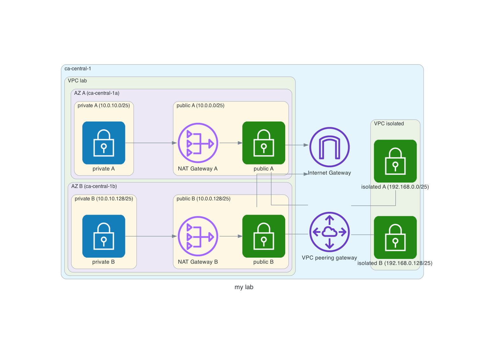

Manage my AWS lab using Ansible
=================================

To create VPC:

```
$ ansible-playbook vpc_create.yml
```

To remove VPC:

```
$ ansible-playbook vpc_delete.yml
```

To add EC2 instances in VPC for example:

```
$ ansible-playbook ec2_cluster_rhel8.yml
```

To remove all EC2 instances:
```
$ ansible-playbook ec2_wipe.yml
```

Requirements
------------

- boto
- boto3
- botocore
- python >= 3.8

Tested with Ansible 2.12.1 and collection amazon.aws 3.1.1.

You need to configure a credential to connect AWS.

For example, 

$HOME/.awx/credentials

```
[default]
aws_access_key_id = XXXXXXXXXXXXXXXXXX
aws_secret_access_key = XXXXXXXXXXXXXXXXXXXXXXXXXXXXXXXXXXXX
```

$HOME/.aws/config
```
[default]
region = ap-northeast-3
```

If you create a load balancer, you need to create a certificate at the `AWS Certificate Manager` in advance.

And if you want to use another region, please specify the AMI ID in the file `ec2/defaults/main.yml`.


License
-------

BSD

Author Information
------------------

Takashi Sugimura @sugitk


VPC diagram
----



